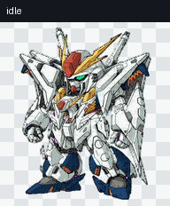

# RX-105 Ξ Gundam — ChatGPT Codex Pet


**Ξ-105** is an animated, source-available desktop companion inspired by the RX-105 Xi Gundam and prepared for the ChatGPT Work custom-pet workflow.

> [!IMPORTANT]
> This is an unofficial, non-commercial fan project. It is not affiliated with, sponsored by, or endorsed by SOTSU, SUNRISE, Bandai Namco, OpenAI, or their affiliates. See the [fan-project notice](NOTICE.md) and [license](LICENSE.md) before reusing anything.



## Highlights

- Nine complete animation states
- Sixteen smooth look directions
- Minovsky-flight movement and hover animations
- Transparent, validated v2 sprite atlas
- Dedicated front and rear design references
- Per-state GIF previews and a complete motion reel
- Reproducible preview-rendering utility
- Validation and visual-quality reports

## Animation set

| State | Frames | Purpose |
| --- | ---: | --- |
| Idle | 6 | Calm breathing and blinking loop |
| Running right | 8 | Rightward Minovsky flight |
| Running left | 8 | Leftward Minovsky flight |
| Waving | 4 | Greeting and attention gesture |
| Jumping | 5 | Controlled Minovsky hover |
| Failed | 8 | Blocked, failed, or cancelled reaction |
| Waiting | 6 | Waiting for approval or user input |
| Running | 6 | Tactical hover during active task processing |
| Review | 6 | Ready/completed output review |
| Look directions | 16 | Full 360-degree directional tracking |

## Quick start

This repository contains pet assets, not a standalone application.

1. Download [`spritesheet-extended.png`](Pets/%CE%9E-105/final/spritesheet-extended.png).
2. Use the sheet with a ChatGPT Work environment that supports custom Pets.
3. Select or activate the pet through the Pets controls available in that workspace.

The included sheet follows the extended v2 layout:

| Property | Value |
| --- | ---: |
| Canvas | 1536 × 2288 px |
| Grid | 8 columns × 11 rows |
| Cell | 192 × 208 px |
| Color mode | RGBA |
| Background | Transparent |
| SHA-256 | `5b57a60892ee315f6a7bdd170f0baba07861d37a795ddc7bf2c7e253c50e0153` |

## Project layout

```text
Pets/Ξ-105/
├── final/       Final sprite sheet and machine-readable validation
├── previews/    Full reel, look loop, per-state GIFs, and stills
├── references/  Approved character views
├── prompts/     Generation and repair prompts
├── qa/          Direction, continuity, and quality checks
└── tools/       Preview-rendering utility
```

Useful entry points:

- [Final sprite sheet](Pets/%CE%9E-105/final/spritesheet-extended.png)
- [All animation states](Pets/%CE%9E-105/previews/final/all-states.gif)
- [Look-direction loop](Pets/%CE%9E-105/previews/final/look-loop.gif)
- [Approved rear reference](Pets/%CE%9E-105/references/canonical-back-v3.png)
- [Validation report](Pets/%CE%9E-105/final/validation-extended.json)
- [Pet manifest](Pets/%CE%9E-105/pet_request.json)

## Rebuild the previews

The optional preview script requires Python 3.9 or newer and [Pillow](https://pillow.readthedocs.io/).

```bash
python -m pip install -r requirements.txt
python "Pets/Ξ-105/tools/render_final_previews.py" \
  "Pets/Ξ-105/final/spritesheet-extended.png" \
  --frames-root /tmp/xi-105-frames \
  --preview-dir /tmp/xi-105-previews
```

## Quality status

Version 1.1 passes the included atlas validation with the expected canvas, grid, transparency, and animation occupancy. The visual QA files document look-direction semantics, rear-view consistency, and continuity checks.

## Contributing

Small improvements and QA fixes are welcome. Read [CONTRIBUTING.md](CONTRIBUTING.md) before opening a pull request. Contributions must be original or properly licensed and must be compatible with this project's non-commercial terms.

## License and fan-content notice

This repository uses scoped, non-commercial terms:

- Original artwork, animations, prompts, and documentation: [CC BY-NC-SA 4.0](https://creativecommons.org/licenses/by-nc-sa/4.0/), only to the extent the maintainer has authority to license them.
- Original software in `tools/`: [PolyForm Noncommercial 1.0.0](https://polyformproject.org/licenses/noncommercial/1.0.0).
- Gundam-related names, designs, trademarks, and other third-party intellectual property are excluded. No rights in those elements are granted here.

Read [LICENSE.md](LICENSE.md) for the exact scope and [NOTICE.md](NOTICE.md) for the ownership, affiliation, and rights-holder notice. Non-commercial distribution and disclaimers do **not** guarantee that a rights holder cannot object or make a claim.

## Release

Current release: **v1.1** — see [CHANGELOG.md](CHANGELOG.md).

---

Created as a fan-made ChatGPT Codex pet project by [Otaku0080](https://github.com/Otaku0080).
